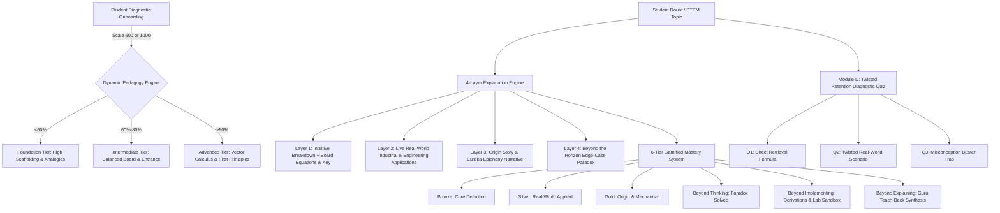

# BhashaGuru: AI-Powered Adaptive STEM Learning Platform
*Intermediate Classes 11 & 12 | Antigravity AI Engine (Gemini 3.8 / 2.5 Flash)*

---

## 1. System Overview & Architectural Architecture

**BhashaGuru** is an intelligent, adaptive STEM tutoring platform specifically designed for Intermediate students (Classes 11 & 12 / Junior College / CBSE / JEE & NEET). It bridges cognitive gaps by pairing personalized pedagogical scaffolding with regional learning dialects (**English, Hindi, Telugu, Hinglish, Tenglish**) while strictly enforcing scientific precision in mathematical laws and equations.

---

## 2. Core Modules Implemented

### Module A: Diagnostic Assessment & Onboarding
- **Grade Capture**: Intermediate 1st Year (Class 11) or Intermediate 2nd Year (Class 12).
- **Dual Scale Performance Calculation**:
  - Out of **600 Marks** (AP & Telangana Board 1st year / standard IPE format)
  - Out of **1000 Marks** (Full 2-year aggregate)
- **Live Dynamic Pedagogy Assignment**:
  - **Foundation (<60%)**: High scaffolding, step-by-step physical analogies (e.g. beach balls in water), explicit line-by-line algebra, conversational spoon-feeding.
  - **Intermediate (60%–80%)**: Balanced conceptual depth, standard board derivations, common exam traps, and formula key mapping.
  - **Advanced (>80%)**: High mathematical rigor, direct fundamental differential laws, non-inertial frames, cross-chapter synthesis.
- **Teaching Dialect Engine**:
  - **Standard English**
  - **Hinglish (Hindi + English)**: Relatable colloquial phrasing (*"Jab koi body fluid me immerse hoti hai..."*)
  - **Tenglish (Telugu + English)**: Relatable colloquial phrasing (*"Oka object fluid lo immerse ainappudu..."*)
  - **Scientific Constraint Enforced**: All formulas, technical laws, variables ($F_B$, $\rho$, $\mathcal{E}$), and standard SI units strictly remain in English across all dialects.

---

### Module B: 3-Layer Concept Explanation Engine (+ Beyond the Horizon)
When a student inputs any doubt or selects a topic:
1. **Layer 1: Core Concept & Exam Steps**
   - **Dual Format**:
     - *1A. Intuitive Breakdown*: Tailored dynamically to the student's assigned pedagogy tier and preferred dialect.
     - *1B. Formal Board & Entrance Standard*: Verbatim textbook definition, KaTeX rendered governing equations, and a comprehensive variable key with SI units.
   - *Exam Steps Guide*: Step-by-step full-marks blueprint for derivations and numericals.
   - *Integrated Audio Narrator*: Web Speech API reads the explanation aloud with speed control (0.9x, 1.0x, 1.25x).
2. **Layer 2: Live Real-World Application**
   - Concrete societal and engineering systems (e.g., Submarine ballast tanks, cargo ship Plimsoll marks, bullet train magnetic eddy-current brakes, CMOS cameras).
   - Mechanical mechanism breakdown and interactive engineering notes.
3. **Layer 3: Origin Story**
   - Narrative of discovery (King Hiero II's gold crown fraud, Archimedes taking a public bath, water displacement, and the naked *"Eureka!"* sprint through Syracuse; Heinrich Lenz discovering the opposing magnetic force; Daniel Bernoulli; Einstein's 1905 miracle year).
   - Epiphany Key highlighting the fundamental insight that cracked the puzzle.
4. **Layer 4: Beyond the Horizon (Edge-Case Paradox)**
   - "What if?" physical thought experiment (e.g., what happens to buoyant force in a free-falling elevator with snapped cables? What happens to a magnet dropped down a 4K superconducting pipe?).
   - Interactive hypothesis selector with immediate physical feedback and rank unlocking.

---

### Module C: 6-Tier Gamified Mastery System
Tracks XP and visualizes rank progression:
| Rank | Title | XP Range | Requirement & Focus |
| :--- | :--- | :--- | :--- |
| **Rank 1: Bronze** | Bronze Scholar | 0 – 99 XP | Understand core definitions and variables |
| **Rank 2: Silver** | Silver Engineer | 100 – 249 XP | Apply physical laws to real-world machinery |
| **Rank 3: Gold** | Gold Historian | 250 – 449 XP | Master the origin, crisis, and Eureka mechanism |
| **Rank 4: Beyond Thinking** | Beyond Thinking | 450 – 699 XP | Solve non-inertial and edge-case paradoxes |
| **Rank 5: Beyond Implementing** | Beyond Implementing | 700 – 999 XP | Solve complex derivations and numericals in Sandbox |
| **Rank 6: Beyond Explaining** | Beyond Explaining (Guru) | 1000+ XP | Synthesize and teach the concept simply (Feynman Technique) |

- **Milestone Celebrations**: Web Audio API synthesized fanfare and confetti burst on each rank advancement.
- **Interactive Sandbox (Tier 5)**: Step-by-step derivation verification + live parameter slider simulation for fluid density, volume, and gravity.
- **Teach-Back Evaluator (Tier 6)**: AI evaluates student synthesis for pedagogical clarity and assigns a score out of 100.

---

### Module D: Retention Module ("Twisted" Quick Revision Quiz)
- **Doubt Vault**: Persistent query history log tracking all student doubts, timestamps, tiers, and quiz performance.
- **3-Question Diagnostic Quiz**:
  - **Question 1 (Direct Retrieval)**: Core formula application or definition.
  - **Question 2 (Twisted Real-World Scenario)**: Counter-intuitive conditions (e.g., ice melting in an upwardly accelerating elevator).
  - **Question 3 (Misconception Buster)**: Focus on classic traps (e.g., steel vs cork of identical volumes experiencing identical buoyant forces).
- **Interactive Feedback**: Immediate green/red visual states, detailed explanatory derivations, and +20 XP per correct question (+ bonus for 3/3).

---

## 3. Technology Stack & Running Instructions

- **Frontend**: React 19 + Vite 8
- **Styling**: Vanilla CSS Design System with dark STEM glassmorphism, responsive flex/grid layouts, and neon quantum accents.
- **Math Rendering**: KaTeX 0.19 (`katex/dist/katex.min.css`) supporting both inline `$..$` and block `$$..$$` LaTeX.
- **Audio**: Web Speech API for lesson narration + Web Audio API synthesizer for zero-dependency sound effects.
- **Local Dev Server**: Running on `http://localhost:5173/`.
